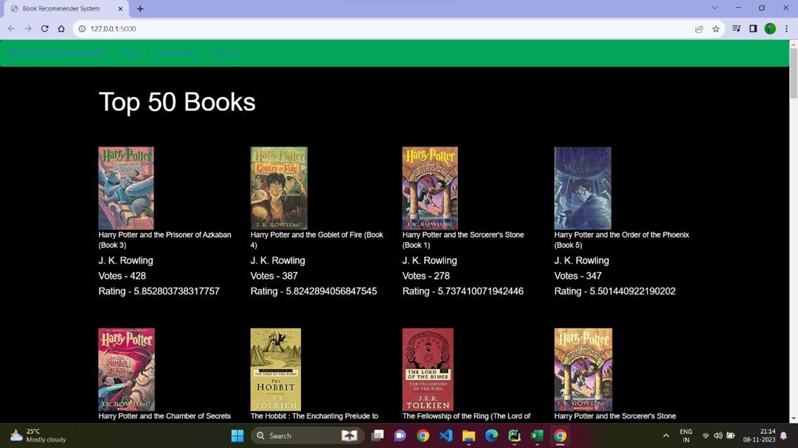
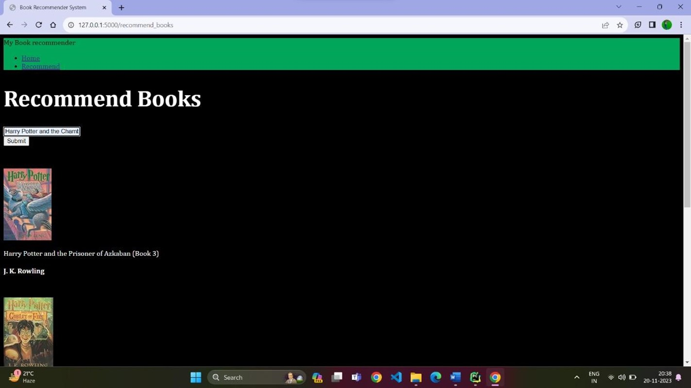

# Book Recommendation System

## Abstract
This repository contains the Minor Project-I Report submitted by Group No. 07 for the development of a Book Recommendation System. The project aims to create a personalized recommendation system for book enthusiasts using machine learning techniques.

## Team Members
- Disha Vishwakarma
- Niharika Ninnoriya 
- Yuvika Sinha

## Project Guide
- Prof. Abhuday Tripathi (Assistant Professor)

## Table of Contents
1. [Introduction](#introduction)
2. [Software & Hardware Requirements](#software--hardware-requirements)
3. [Problem Description](#problem-description)
4. [Literature Survey](#literature-survey)
5. [Software Requirements Specification](#software-requirements-specification)
6. [Interface Screenshots](#interface-screenshots)
8. [Deployment](#deployment)
9. [Conclusion and Future Work](#conclusion-and-future-work)
11. [Project Summary](#project-summary)

## Introduction
### About Project
The Book Recommendation System project aims to develop a machine learning-based system capable of providing personalized book recommendations to users. It addresses the challenge of book discovery in the age of information abundance, simplifying the process of finding the next great read.

### Project Objectives
1. Gather and preprocess book data.
2. Implement collaborative filtering and content-based filtering techniques.
3. Develop a user-friendly interface for receiving book recommendations.
4. Evaluate the performance of recommendation models using relevant metrics.
5. Enhance the system's recommendation accuracy through iterative improvements.

## Software & Hardware Requirements
### Software Requirements
- Python 3.x
- TensorFlow
- Flask
- HTML, CSS

### Hardware Requirements
- Dual-core 64-bit processor
- 8 GB RAM

## Problem Description
In the age of information abundance, finding the perfect book can be a daunting task. This project addresses the need for a personalized book recommendation system to simplify the process of book discovery and enhance the user's reading experience.

## Literature Survey
Previous research in the field of recommendation systems and machine learning has laid the foundation for this project. Various algorithms and techniques for collaborative filtering and content-based recommendation have been explored in the context of book recommendation systems.

## Software Requirements Specification
### Functional Requirements
1. Book Recommendation:
   - The system shall provide personalized book recommendations based on user preferences.
   - Recommendations should consider factors such as genre, author, and user ratings.

2. User Interface:
   - Users can input their reading history and preferences.
   - The interface should display recommended books with relevant details.

### Non-Functional Requirements
1. Performance:
   - The system should provide fast and accurate recommendations, responding within seconds to user requests.

2. Usability:
   - The user interface should be intuitive and easy to navigate, promoting a seamless user experience.

## Interface Screenshots

### Deployment Instructions
1. Clone the repository to your local machine.
2. Install the required dependencies using pip.
3. Run the Flask application to start the server.

## Conclusion and Future Work
The Book Recommendation System project has successfully addressed the challenge of book discovery by providing personalized recommendations to users. Future enhancements may include refining recommendation algorithms, improving user interface features, and expanding the system's database of books.

## Project Summary
For a detailed summary of the project, including team members' roles and responsibilities, please refer to the [Project Summary](#project-summary) section in the report.
